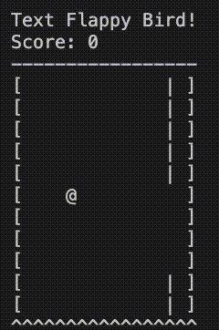

# Text Flappy Bird for OpenAI Gym

This repository contains the implementation of two OpenAI Gym learning environments of a simple unit-pixel player version of the Flappy Bird. The code base is heavily borrows from the [flappy-bird-gym](https://github.com/Talendar/flappy-bird-gym) repository.

It is inspired by the NetHack game and can be rendered within a terminal using simple character elements. The two environments differ only in the yielded observations. The `TextFlappyBird-screen-v0` returns the array that represents the current state of the game screen encoded as integers while the `TextFlappyBird-v0` returns the horizontal and vertical distance of the player to the closest upcoming pipe gap.



## Installation

You can install the gym using the following command:

```
pip install text-flappy-bird-gym
```

## Usage

